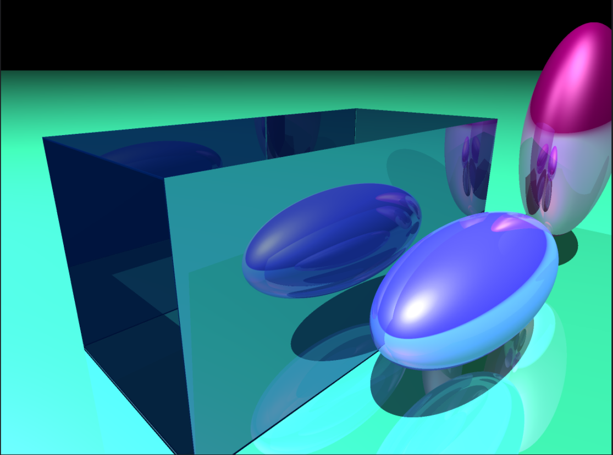
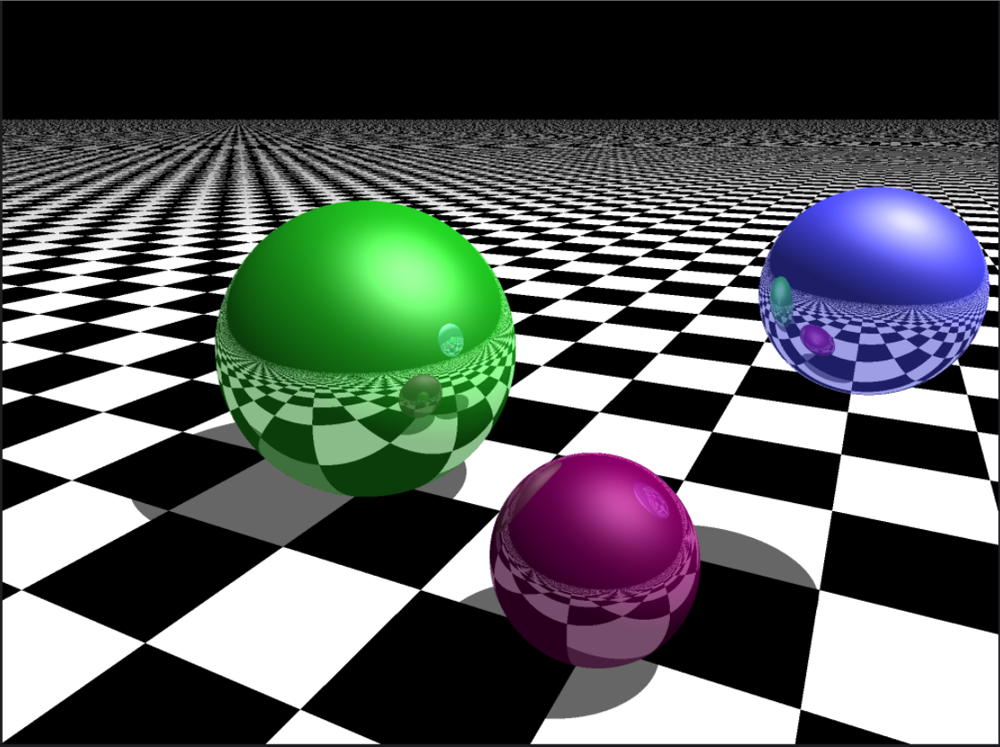
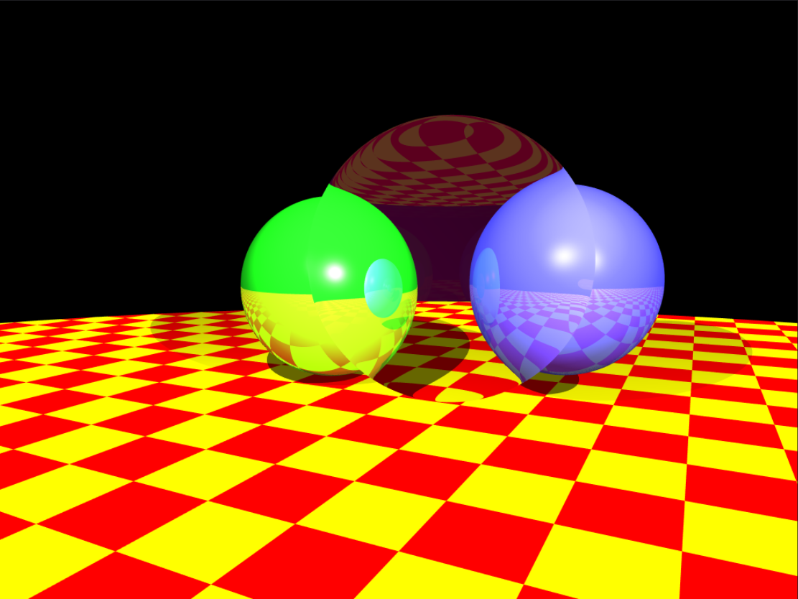
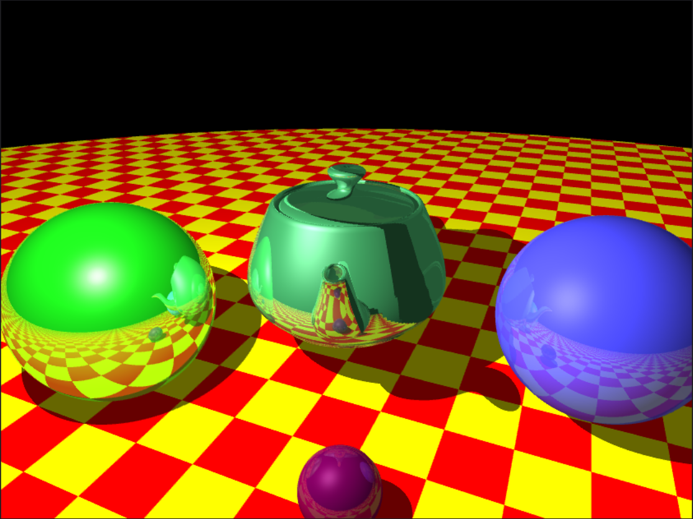
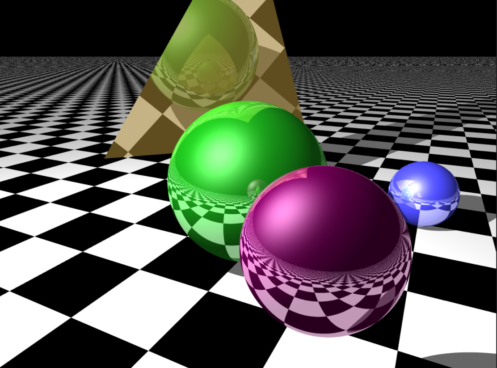
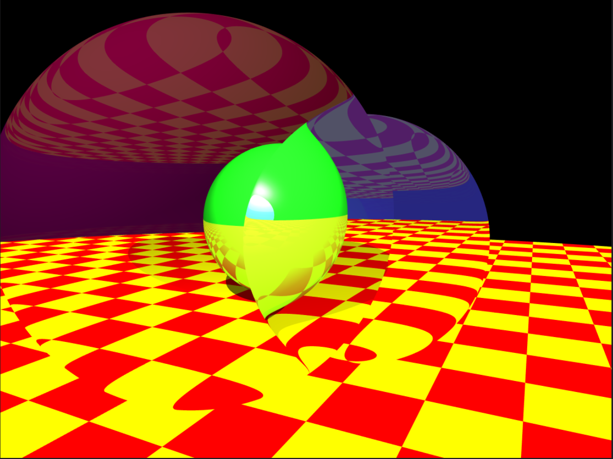

# raytracer
Raytraced rendering of images with various shapes using realistic reflections and shadows.

Intersections supported for Planes, Spheres and Triangles. The barycentric co-ordinates for the intersection point are computed for any intersection point inside a triangle, which helps compute an interpolated vertex normal, which in turn gives a much smoother shading effect.

The recursion depth for computing reflections is currently set to 5, increase it at your own risk :)

The render times can be greatly improved just by using some OpenMP directives to make use of all the cores on your machine.

Following are some of the results I was able to produce with this implementation:

